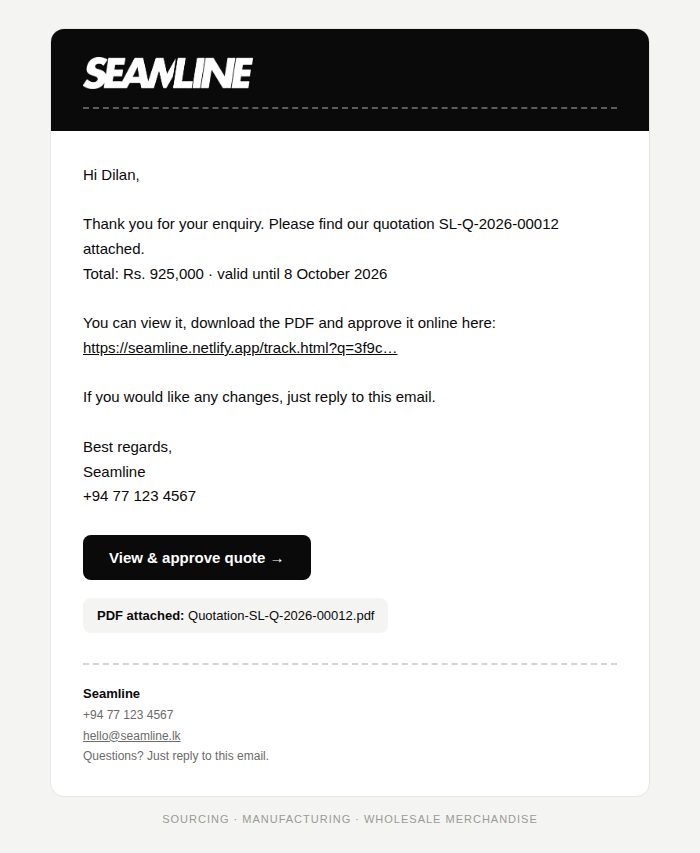
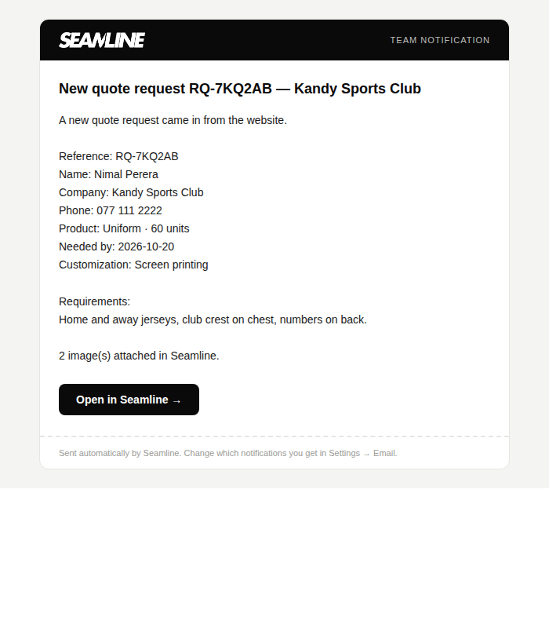

# EmailJS templates for Seamline

Create two templates in EmailJS → **Email Templates → Create New Template**.
For **Content**, click the **Code** (`<>`) button in the editor, delete everything and paste the file's contents.

## 1. Customer template — `customer-template.html`

| Field | Value |
|---|---|
| Subject | `{{subject}}` |
| **To Email** | **`{{to_email}}`** — exactly this. If it is empty, EmailJS says “The recipients address is empty”. |
| From Name | `{{from_name}}` |
| Reply To | `{{reply_to}}` |
| Content | paste `customer-template.html` |
| Attachments tab | *Optional — paid EmailJS plans only.* **Add Attachment → Variable Attachment**, parameter name `pdf`, filename `{{pdf_name}}`, content type PDF. Then tick “Attach quote and invoice PDFs” in Seamline → Settings → Email. On the free plan, skip this: every email has a button where the customer views and downloads the PDF. |

## 2. Team notification template — `team-template.html`

| Field | Value |
|---|---|
| Subject | `{{subject}}` |
| **To Email** | **your own email address**, typed in (not a variable) |
| From Name | `Seamline` |
| Content | paste `team-template.html` |

Then copy each **Template ID**, your **Service ID** and your **Public key** (Account → General) into Seamline → Settings → Email, save, and click **Send a test email**.

The logo loads from your hosted Seamline address (`assets/logo-white.png`). While you test on Live Server the logo can't load in the email, and the company name shows instead — it appears once Seamline is hosted online.
